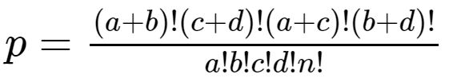

```{r setup, include=FALSE}
knitr::opts_chunk$set(echo = TRUE)

library(dplyr)
library(tidyverse)
library(gmp)
library(tibble)
library(knitr)

# lists election results by country for singapore and the west
Singapore <- tibble(
  country = c(rep("Singapore",14)),
  election = c(1959,1963,1968,1972,1976,1980,1984,1988,1991,2001,2006,2011,2015,2020),
  change = c(rep(0,14))
)
US <- tibble(
  country = c(rep("US",16)),
  election = c(1960,1964,1968,1972,1976,1980,1984,1988,1992,1996,2000,2004,2008,2012,2016,2020),
  change = c(1,0,1,0,1,1,0,0,1,0,1,0,1,0,1,1)
)
UK <- tibble(
  country = c(rep("UK",16)),
  election = c(1964,1966,1970,1974,1974,1979,1983,1987,1992,1997,2001,2005,2010,2015,2017,2019),
  change = c(1,0,1,1,0,1,0,0,0,1,0,0,1,0,0,0)
)
Canada <- tibble(
  country = c(rep("Canada",20)),
  election = c(1962,1963,1965,1968,1972,1974,1979,1980,1984,1988,1993,1997,2000,2004,2006,2008,2011,2015,2019,2021),
  change = c(0,1,0,0,0,0,1,1,1,0,1,0,0,0,1,0,0,1,0,0)
)
AUS <- tibble(
  country = c(rep("AUS",24)),
  election = c(1961,1963,1966,1969,1972,1974,1975,1977,1980,1983,1984,1987,1990,1993,1996,1998,2001,2004,2007,2010,2013,2016,2019,2022),
  change = c(0,0,0,0,1,0,1,0,0,1,0,0,0,0,1,0,0,0,1,0,1,0,0,1)
)
NZ <- tibble(
  country = c(rep("NZ",21)),
  election = c(1960,1963,1966,1969,1972,1975,1978,1981,1984,1987,1990,1993,1996,1999,2002,2005,2008,2011,2014,2017,2020),
  change = c(1,0,0,0,1,1,0,0,1,0,1,0,0,1,0,0,1,0,0,1,0)
)

```

## **Summary**

Sacha Baron Cohen's character in The Dictator feeds the stereotype that authoritarian leaders reign only in poorer, less educated societies. This assumption is challenged here by demonstrating statistically that Singapore, a high income country with an education sector rivaling the West, likely has a substantially flawed democracy. 

&nbsp;

## **Party changes**

Since the time of Singapore's first election in 1959, many Western liberal democracies have experienced multiple changes in power. This is not the case for Singapore, who's People's Action Party (PAP) has won all 14 of the country's elections. 

```{r, echo = FALSE, message = FALSE, warning = FALSE, dpi=600}

# gets a scatter plot of election results between UK and Singapore
get_scatter <- function(df, title='') {
  n <- nrow(df)
  color <- list()
  for(i in 1:nrow(df)) {
    color[i] <- if(df$change[i]==0) 'blue' else 'red'
  }
  set.seed(123)
  c <- tibble(
    height = rnorm(n, mean=5, sd=1.2),
    width = rnorm(n, mean=5, sd=1.25),
    change = unlist(color)
  )
  plot(c$height, c$width, 
       xaxt='n', yaxt='n', 
       pch=19, cex=1.75, col=c$change, 
       xlab='', ylab='', main = title)
}
par(mfrow = c(2, 3))
get_scatter(Singapore, 'Singapore')
get_scatter(US, 'US')
get_scatter(UK, 'UK')
get_scatter(Canada, 'Canada')
get_scatter(AUS, 'AUS')
get_scatter(NZ, 'NZ')
legend("topright", inset = c(0, 0),
       legend = c("Change", "Remain"),
       pch = 19,
       col = c('red', 'blue'))

```

## **Party change rate**

The average party change rate in Western liberal democracies is between 30% and 50%. Singapore's on the other hand is 0%. But could this have happened by chance? 

```{r, echo = FALSE, message = FALSE, warning = FALSE, dpi=600}

# print the change ratio of each country
change_ratio <- function(country) {
  return(sum(country$change)/length(country$election))
}

# returns data on on the change rate of each country
get_change_ratios <- function(countries) {
  change_rate <- list()
  for(i in 1:length(countries)) {
    change_rate[i] = (change_ratio(eval(parse(text=countries[i])))*100)
  }
  # creates and returns an ordered data frame of each country's change rate
  change_rate_df <- tibble(country=countries, change_rate=unlist(change_rate))
  return(change_rate_df[order(change_rate_df$change_rate,decreasing=TRUE),])
}
# creates a data frame of the change rate results
change_rate_df <- get_change_ratios(c("Singapore", "US", "UK", "Canada", "AUS","NZ"))

# creates a barplot of countries by change rate
barplot(change_rate_df$change_rate, names.arg=c(pull(change_rate_df[1])), 
        col="#336600", ylab="Change rate (%)", main="Party change rate")

```

&nbsp;

## **Fisher's Exact Test**

Fisher's Exact Test can be used to determine the likelihood that such an outcome could have occurred by chance.

```{r, echo = FALSE, message = FALSE, warning = FALSE, dpi=600}

# combines western democracies into a single data frame for analysis
west <- US %>% rbind(UK) %>% rbind(Canada) %>% rbind(AUS) %>% rbind(NZ)

# displays a contingency table
contingency_table <- tibble(
  change = c("Change", "Remain"),
  Singapore = c(sum(Singapore$change), sum(Singapore$change==0)),
  West = c(sum(west$change),sum(west$change==0))
)
table <- column_to_rownames(contingency_table, "change")
kable(table, format = "simple", align = "l")

```

&nbsp;

```{r cars, eval=FALSE,echo=FALSE}
# commented out because does not render properly on github dark mode
# a picture of the commented out formula is inserted below instead
# $p = \frac{(a+b)!(c+d)!(a+c)!(b+d)!}{a!b!c!d!n!}$
```



&nbsp;

Where...

- p = the probability Singapore's election results occurred by chance
- a = Singapore change
- b = West change
- c = Singapore remain
- d = West remain
- n = total number of elections
- ! = factorial - the product of an integer and all the integers below it

```{r, echo = FALSE, message = FALSE, warning = FALSE, dpi=600}

# combines western democracies into a single data frame for analysis
west <- US %>% rbind(UK) %>% rbind(Canada) %>% rbind(AUS) %>% rbind(NZ)

# fisher's exact test (one-tailed p-values)
fishers_test <- function(var_1,var_2,one_tail=FALSE) {
  # two tailed p-value calculation (by default)
  if(one_tail==TRUE) {
    # creates contingency table variables
    a = as.bigz(sum(var_1==1))
    b = as.bigz(sum(var_2==1))
    c = as.bigz(sum(var_1==0))
    d = as.bigz(sum(var_2==0))
    n = a+b+c+d
    # one-tailed p-value calculation (if chosen)
    nom = factorial(a+b)*factorial(c+d)*factorial(a+c)*factorial(b+d)
    denom = factorial(n)*factorial(a)*factorial(b)*factorial(c)*factorial(d)
    return(as.numeric(nom/denom))
  }
  else if(one_tail==FALSE) {
    df = tibble(singapore = c(sum(var_1==0), sum(var_1==1)), 
                west = c(sum(var_2==0), sum(var_2==1)))
    result <- fisher.test(df)
    return(result$p.value)
  }
}
# returns the likelihood Singaporean election results occurred by chance
result <- fishers_test(Singapore$change, west$change, one_tail=TRUE)


```

&nbsp;

P-value --- `r result`

&nbsp;

The result indicates that the likelihood of Singapore holding 14 elections without a single change in governing party, based on the behavior observed in the handful of liberal democracies included here, is just a `r round(result*100,2)`%. 

&nbsp;

## **Statistical significance**

As can be seen from the plot below, the P-value obtained from Fisher's Exact Test is well under the 0.05 (5%) threshold widely deemed to be statistically significant.

```{r, echo = FALSE, message = FALSE, warning = FALSE, dpi=600}

# returns the results of fisher's exact test using different sample sizes
get_samples_results <- function(a,b,samples) {
  # lists the samples results at different sizes
  sample_results <- list()
  for(i in 1:length(samples)) {
    # sets seed for sample reproducibility.
    set.seed(123)
    sample_results[i] <- fishers_test(a, sample(b, samples[i]))
  }
  # creates a data frame for sample size and resulting p-values
  sample_results_df <- tibble(
    size = samples,
    results = unlist(sample_results)
  )
  return(sample_results_df)
}
# plots the decline in the p-value as sample size increases
sample_results_df <- get_samples_results(Singapore$change, west$change, c(seq(10,90,10)))
plot(sample_results_df$size, sample_results_df$results, type="o", col="red", xlab="West samples", ylab="P-value", main = "P-value vs sample size")
abline(h=0.05, col="blue")


```


&nbsp;

## **Monte Carlo Simulation**

To visualize how unlikely this outcome would be for a genuine liberal democracy, a Monte Carlo simulation involving 100,000 trials of 14 random samples from a pool of the West's collective election results was run. The bar to he left of the red line indicates how often 0 changes occurred.  

```{r, echo = FALSE, message = FALSE, warning = FALSE, dpi=600}

n <- 10^5

# runs a monte carlo simulation for 
run_monte_carlo <- function(n) {
  samples <- list()
  for(i in 1:n) {
    samples[i] <- sum(sample(west$change, 14, replace=TRUE))
  }
  return(unlist(samples))
}
samples <- run_monte_carlo(n)

hist(samples, breaks=13, include.lowest=TRUE, right=F, col='darkblue',
     main="Trials = 100,000", xlab="Election changes", ylab="Trials")
abline(v=1, col="red")

```

&nbsp;

Percentage of trials with 0 changes --- `r round((sum(samples==1) / n),3)`%

&nbsp;

## **Supporting evidence**

Additional evidence comes from the Economist Intelligence Unit (EIU)'s Democracy Index (2022). Out of a total of 167 countries ranked by the EIU, Singapore remains 70 places off the top spot.  

```{r, echo = FALSE, message = FALSE, warning = FALSE, dpi=600}

# creates a data frame of singapore vs the west EIU demcoracy index
EIU <- tibble(
  country = c("Singapore", "US", "UK", "Canada", "AUS", "NZ"),
  rank = c(70, 30, 18, 12, 15, 2)
)

# orders countries by rank
EIU <- EIU[order(EIU$rank,decreasing=FALSE),]

# creates a barplot of countries by the Economist's assessment of their democracy
barplot(EIU$rank, names.arg=c(pull(EIU[1])), col="#993333", 
        main="EIU Democracy Index (2022)",  ylab="Global rank")

```

&nbsp;

## **Method**

#### Elections coding rules

- This analysis included all elections in each country since Singapore's first in 1959
- A change was defined as when a party receives more of the vote than the previous winner
- If no overall majority was achieved, the party with the highest single share of the vote was deemed the winner
- Where multiple parties regularly banded into coalitions, broad changes ideology were used (liberal, conservative etc.)
- If both a president and a prime minister existed, the most powerful position in that country was used

&nbsp;

#### Test choice & limitations

A one tailed Fisher's Exact Test was employed here. If a two tailed test is used instead, the results are still statistically significant. The results however only indicate the likelihood that Singapore's election outcomes could have occurred by chance - and seemingly unlikely events do sometimes happen by chance. This project therefore cannot be taken as definitive proof of a flawed democracy in Singapore. 

&nbsp;

## **Sources**

- Economist Intelligence Unit (2023) https://www.eiu.com/n/campaigns/democracy-index-2022/

- Wikipedia / Singapore (2023) https://en.wikipedia.org/wiki/Prime_Minister_of_Singapore

- Wikipedia / US (2023) https://en.wikipedia.org/wiki/List_of_presidents_of_the_United_States

- Wikipedia / UK (2023) https://en.wikipedia.org/wiki/List_of_prime_ministers_of_the_United_Kingdom

- Wikipedia / Canada (2023) https://en.wikipedia.org/wiki/List_of_prime_ministers_of_Canada

- Wikipedia / Australia (2023) https://en.wikipedia.org/wiki/List_of_prime_ministers_of_Australia

- Wikipedia / New Zealand (2023) https://en.wikipedia.org/wiki/List_of_prime_ministers_of_New_Zealand

&nbsp;