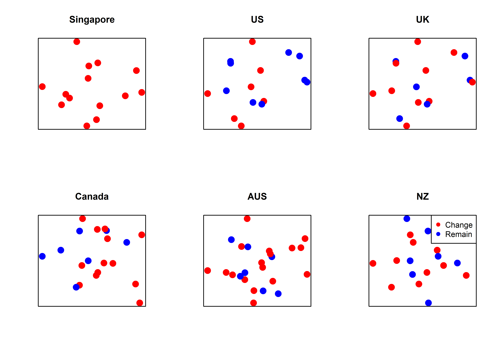
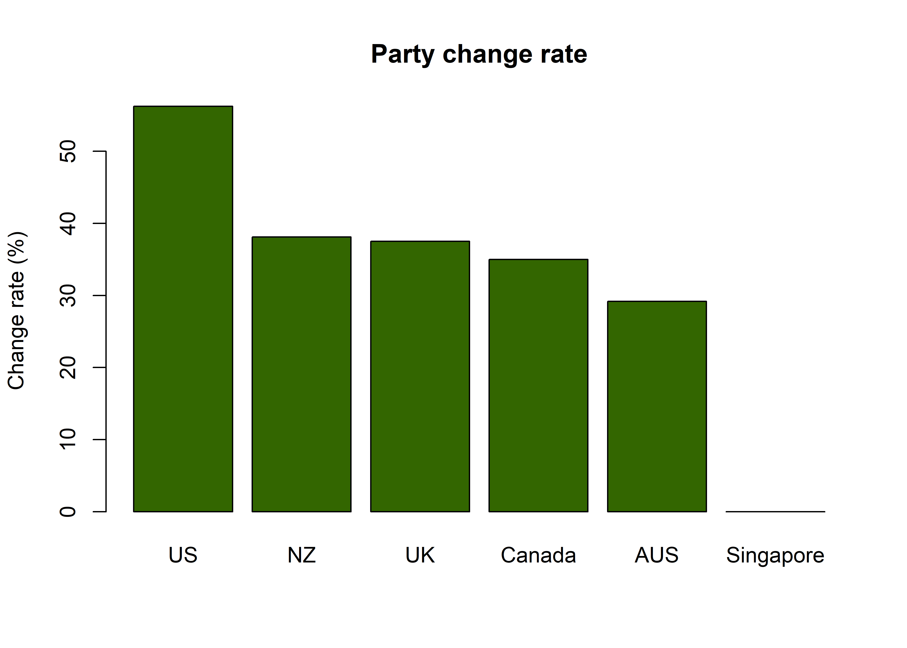
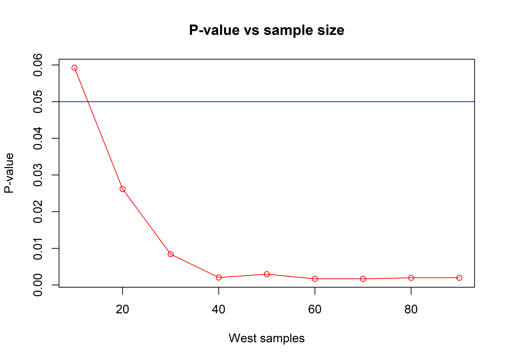
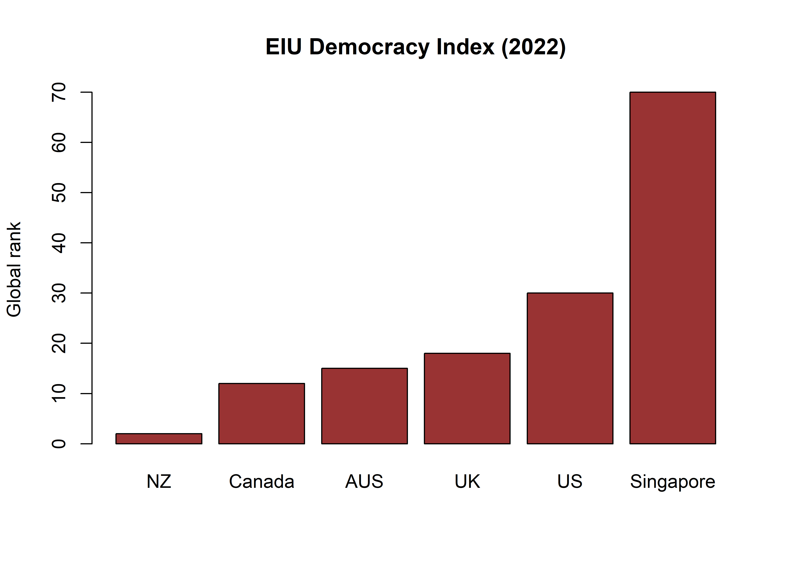

The Dictator
================
Jack Carter
5/3/2023

## **Summary**

Sacha Baron Cohen’s character in The Dictator feeds the stereotype that
authoritarian leaders reign only in poorer, less educated societies.
This assumption is challenged here by demonstrating statistically that
Singapore, a high income country with an education sector rivaling the
West, appears to have a less than democratic regime.

 

## **Party changes**

Since the time of Singapore’s first election in 1959, many Western
liberal democracies have experienced multiple changes in power. This is
not the case for Singapore, who’s People’s Action Party (PAP) has won
all 14 of the country’s elections.

<!-- -->

## **Party change rate**

The average party change rate in Western liberal democracies is between
30% and 50%. Singapore’s on the other hand is 0%. But could this have
occurred simply by chance?

<!-- -->

 

## **Fisher’s Exact Test**

Fisher’s Exact Test can be used to determine the likelihood that such an
outcome occurred by chance.

|        | Singapore | West |
| :----- | --------: | ---: |
| Change |         0 |   37 |
| Remain |        14 |   60 |

 

  
!(c+d)!(a+c)!(b+d)!}{a!b!c!d!n!}")  

 

Where…

  - p = the probability the election results occurred by chance
  - a = Singapore change
  - b = West change
  - c = Singapore remain
  - d = West remain
  - \! = factorial - the product of an integer and all the integers
    below it

 

P-value — 0.0021691

 

The result indicates that the likelihood of Singapore holding 14
elections without a single change in governing party, based on the
behavior observed in the handful of liberal democracies included here,
is just a 0.22%.

 

## **Statistical significance**

As can be seen from the visualization below, the P-value obtained from
Fisher’s Exact Test is well below the 0.05 (5%) threshold widely deemed
to be statistically significant.

<!-- -->

 

## **Supporting evidence**

Additional evidence comes from the Economist Intelligence Unit (EIU)’s
Democracy Index (2022). Out of a total of 167 countries ranked by the
EIU, Singapore remains 70 places off the top spot.

<!-- -->

 

## **Method**

#### Elections coding rules

  - The analysis included all elections in each country since
    Singapore’s first in 1959
  - A change was defined as when a party receives more of the vote than
    the previous winner
  - If no overall majority was achieved, the party with the highest
    single share of the vote was deemed the winner
  - Where multiple parties regularly band into coalitions, broad changes
    ideology were used (liberal, conservative etc.)
  - If both a president and a prime minister existed, the most powerful
    position in that country was used

 

#### Test choice & limitations

A one tailed Fisher’s Exact Test was used. If a two tailed test is used
instead, the results are still statistically significant. The results
however only indicate the likelihood that the Singaporean election
results could have occurred by chance - and seemingly unlikely events do
sometimes happen. This project therefore cannot be taken as definitive
proof of the presence of a flawed democracy in Singapore.

 

## **Sources**

  - Economist Intelligence Unit (2023)
    <https://www.eiu.com/n/campaigns/democracy-index-2022/>

  - Wikipedia / Singapore (2023)
    <https://en.wikipedia.org/wiki/Prime_Minister_of_Singapore>

  - Wikipedia / US (2023)
    <https://en.wikipedia.org/wiki/List_of_presidents_of_the_United_States>

  - Wikipedia / UK (2023)
    <https://en.wikipedia.org/wiki/List_of_prime_ministers_of_the_United_Kingdom>

  - Wikipedia / Canada (2023)
    <https://en.wikipedia.org/wiki/List_of_prime_ministers_of_Canada>

  - Wikipedia / Australia (2023)
    <https://en.wikipedia.org/wiki/List_of_prime_ministers_of_Australia>

  - Wikipedia / New Zealand (2023)
    <https://en.wikipedia.org/wiki/List_of_prime_ministers_of_New_Zealand>
